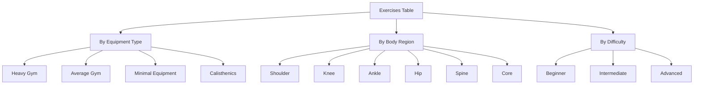

# Exercise Library Database Architecture Plan

## Overview
Creating a comprehensive exercise library for the Sports & Physio Software (ISHPO) with 200+ exercises categorized by equipment requirements.

## Database Schema

### Table: `exercises`
```sql
CREATE TABLE exercises (
    id UUID PRIMARY KEY DEFAULT gen_random_uuid(),
    name TEXT NOT NULL,
    description TEXT,
    category TEXT NOT NULL,           -- 'strength', 'mobility', 'balance', 'plyometric', 'flexibility'
    equipment_type TEXT NOT NULL,      -- 'heavy_gym', 'average_gym', 'minimal_equipment', 'calisthenics'
    difficulty_level TEXT NOT NULL,    -- 'beginner', 'intermediate', 'advanced'
    muscle_groups TEXT[] NOT NULL,     -- Array of muscle groups
    body_region TEXT NOT NULL,         -- 'shoulder', 'knee', 'ankle', 'spine', 'hip', 'upper_extremity', 'lower_extremity', 'core', 'full_body'
    equipment_required TEXT,           -- Specific equipment needed
    instructions TEXT,
    video_url TEXT,
    is_rehabilitation BOOLEAN DEFAULT false,
    is_active BOOLEAN DEFAULT true,
    created_at TIMESTAMPTZ DEFAULT NOW(),
    updated_at TIMESTAMPTZ DEFAULT NOW()
);
```

### Indexes
- Index on `equipment_type` for filtering
- Index on `body_region` for body-part filtering
- Index on `muscle_groups` using GIN for array search
- Composite index on `(body_region, equipment_type)`

## Equipment Categories

### 1. Heavy Gym Set-up (~50 exercises)
Requires: Machines, squat racks, cable stations, Smith machines, leg press
- Examples: Leg Press, Hack Squat, Chest Press Machine, Lat Pulldown, Seated Row

### 2. Average Gym Set-up (~50 exercises)
Requires: Dumbbells, barbells, kettlebells, resistance bands, cable machines
- Examples: Dumbbell Bench Press, Barbell Row, Kettlebell Swing, Farmer's Walk

### 3. Minimal Equipment (~50 exercises)
Requires: Resistance bands, light weights, door frame anchor, chair, wall
- Examples: Band Pull-Apart, Wall Push-ups, Chair Squats, Door Frame Rows

### 4. Calisthenics (~50 exercises)
Requires: Bodyweight only - floor, pull-up bar, parallel bars
- Examples: Push-ups, Pull-ups, Dips, Pistol Squats, Planks

## Body Regions
- Shoulder (rotator cuff, deltoids)
- Knee (quadriceps, hamstrings, patellar)
- Ankle (calf, Achilles)
- Hip (hip flexors, glutes, adductors)
- Spine (cervical, thoracic, lumbar)
- Upper Extremity (elbow, wrist, hand)
- Core (abdominals, obliques)
- Full Body

## Mermaid Diagram - Exercise Categorization



## Files to Create

1. `supabase/migrations/YYYYMMDDHHMMSS_exercise_library.sql` - Table creation
2. `supabase/seed_exercises.sql` - 200+ exercise seed data
3. `scripts/migrate_exercises.ts` - Migration script to deploy

## Seed Data Structure

Each exercise entry includes:
- UUID
- Name
- Description
- Category (strength/mobility/balance/plyometric/flexibility)
- Equipment type (heavy_gym/average_gym/minimal_equipment/calisthenics)
- Difficulty level
- Target muscle groups (array)
- Body region
- Equipment required
- Instructions
- Rehabilitation flag
